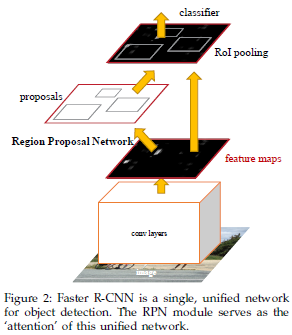
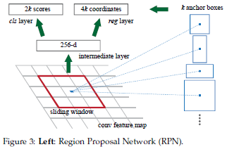
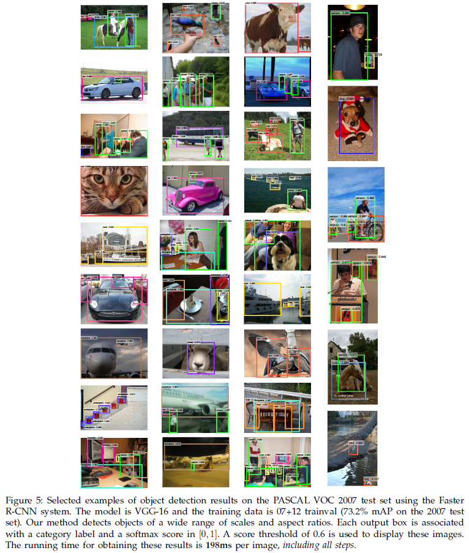
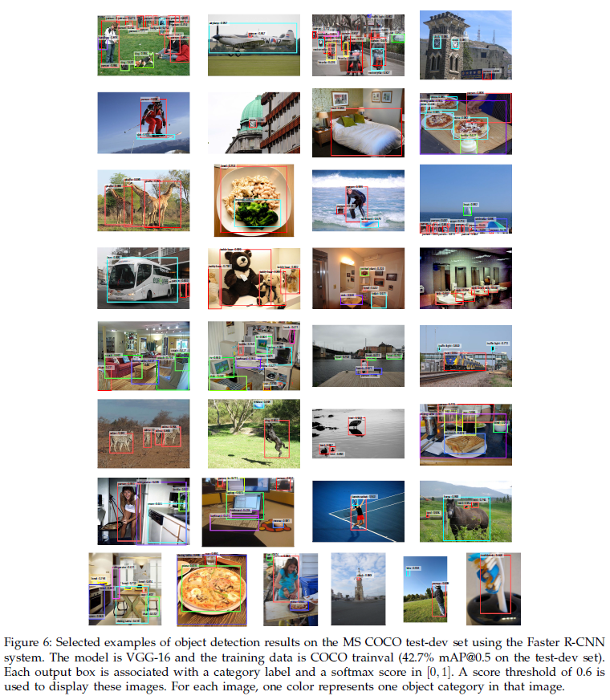

# Faster R-CNN: Towards Real-Time Object Detection with Region Proposal Networks

[arXiv](https://arxiv.org/abs/1506.01497)

[codes](https://github.com/ShaoqingRen/faster_rcnn) originally in Matlab, but exists also for [Python](https://github.com/rbgirshick/py-faster-rcnn)

## TLDR

**Combine** region proposal and classification in a **unified** neural network with state-of-the-art **accuracy** and **speed**.

## Aim

The setup here is supervised learning with datasets of images (possibly from videos) with labeled bounding boxes.

This paper aims at achieving faster ("cost-free") region proposal than previous SPPnet and Fast R-CNN, especially to try and get closer to the in-real-time 30fps speed of a movie at test time. It also achives state-of-the-art object segmentation and classification.

## Methods

The **detection** and **region proposal** networks are pretrained separately and then merged into a single network by sharing the convolutional layers, following a **4-step alternating training** setup (**Approximate joint training**). As shown, many Deep CNN can therefore be modified by adding an RPN and a Region of Interest (ROI) pooling to them.

No multi-scale pyramid are computed because thay have "poor speed-accuracy" performances. Instead, 9 fixed **anchors** of different scales and aspect ratios were handcrafted and used.

The **RPN** is plugged to the last shared convolutional layer. It can be seen as a sliding window that, at each position, computes k bounding boxes based on k anchors. It mainly consists in 3 dense convolutional layers, of which 2 modules are *cls* and *reg*: for each anchor, *cls* predicts a scalar objectness in a bounding box and *reg* predicts the 4d bounding box coordinates.

0.7-**Non Maximum Suppression (NMS)** reduces the number of bounding boxes that are finally proposed for region pooling. At training time, 2 losses are computed for *reg* and *cls* based on a balanced subset of these bounding boxes.

## Technical details

The 9 anchors are 128², 256² and 512², with aspect ratios 1:1, 1:2 and 2:1.

Parameterization for each bounding boxes coordinates takes as an input: 4d vector of output of *reg* and 4d vector of an anchor (handcrafted formulas available in paper).

The anchor boxes may cross image boundaries, in which case they were ignored at training time to avoid large error terms in the loss (reducing the number of boxes from 20k to 6k for a 1000x600 image). During testing, they did clipping instead.

The RPN training loss consists in: an entropy loss for *cls* and a smooth L1 loss for *reg*.

RPN layers were initialized with a zero-mean Gaussian (std=0.01). Optimization (SGD) used a decreasing learning rate (e-3 to e-4), momentum of 0.9 and weight decay of 5e-4.

Implementation on Caffe.

## Experiments - results

They took 2 previous CNN models and built RPN on top of both: Zeiler and Fergus (ZF) model (5 sharable conv layers) and VGG-16 (13 sharable layers).

VGG16 based model gave better but slower results than ZF (5fps and 17fps). As a comparison, Selective Search had 0.5fps.

RPN+VGG gave better mAP than Selective Search on PASCAL VOC 07 and 07+12 with less proposals.

On PASCAL VOC 2007, for required IoU between about 0.5 and 0.75, RPNs had better recalls than SS and EB even with a low amount of proposals. However, when IoU increases, RPNs' recall significantly dropped.

## My thoughts and takeaways

This paper shows significant test time improvements but looks less promising by looking at the recall for high requested IoU.

The method looks quite noble in the sense that it proposes a state-of-the-art efficient network that performs both tasks of segmentation and classification in a unified model and at least 1 order faster than SS.

The choice of subset of bounding boxes that contribute to the loss is hyper-parameterized. Same for the choice of the 9 anchors that seem to quite influence the distribution of the posterior proposed boxes (see averages in table 1, comparison of some choices Table 8).

As mentioned in the paper, "approximate joint training" could be improved into a "non-approximate joint training". See "RoI warping".

VGG-16 is quite heavy in memory and has a huge amount of parameters (138M). As a comparison, the RPN adds 2.4M parameters.

## Top Figures









## Metadata

```
@article{DBLP:journals/corr/RenHG015,
  author    = {Shaoqing Ren and Kaiming He and Ross B. Girshick and Jian Sun},
  title     = {Faster {R-CNN:} Towards Real-Time Object Detection with Region Proposal Networks},
  journal   = {CoRR},
  volume    = {abs/1506.01497},
  year      = {2015},
  url       = {http://arxiv.org/abs/1506.01497},
  archivePrefix = {arXiv},
  eprint    = {1506.01497},
  timestamp = {Mon, 13 Aug 2018 16:46:02 +0200},
  biburl    = {https://dblp.org/rec/bib/journals/corr/RenHG015},
  bibsource = {dblp computer science bibliography, https://dblp.org}
}
```

Tags: Computer Vision Faster RCNN RPN NMS Region proposal Region of Interest PASCAL VOC COCO Detection Segmentation Classification IoU
